# Projects and dependencies analysis

This document provides a comprehensive overview of the projects and their dependencies in the context of upgrading to .NET 9.0.

## Table of Contents

- [Projects Relationship Graph](#projects-relationship-graph)
- [Project Details](#project-details)

  - [MWH.KeyPressCounter.csproj](#mwhkeypresscountercsproj)
- [Aggregate NuGet packages details](#aggregate-nuget-packages-details)

## Projects Relationship Graph

Legend:
📦 SDK-style project
⚙️ Classic project

```mermaid
flowchart LR
    P1["<b>📦&nbsp;MWH.KeyPressCounter.csproj</b><br/><small>net9.0-windows</small>"]
    click P1 "#mwhkeypresscountercsproj"

```

## Project Details

### MWH.KeyPressCounter.csproj

#### Project Info

- **Current Target Framework:** net9.0-windows
- **Proposed Target Framework:** net10.0-windows
- **SDK-style**: True
- **Project Kind:** WinForms
- **Dependencies**: 0
- **Dependants**: 0
- **Number of Files**: 8
- **Lines of Code**: 2028

#### Dependency Graph

Legend:
📦 SDK-style project
⚙️ Classic project

```mermaid
flowchart TB
    subgraph current["MWH.KeyPressCounter.csproj"]
        MAIN["<b>📦&nbsp;MWH.KeyPressCounter.csproj</b><br/><small>net9.0-windows</small>"]
        click MAIN "#mwhkeypresscountercsproj"
    end

```

#### Project Package References

| Package | Type | Current Version | Suggested Version | Description |
| :--- | :---: | :---: | :---: | :--- |
| MouseKeyHook | Explicit | 5.7.1 |  | ⚠️NuGet package is incompatible |
| System.Diagnostics.PerformanceCounter | Explicit | 8.0.0 | 10.0.0 | NuGet package upgrade is recommended |
| System.Management | Explicit | 8.0.0 | 10.0.0 | NuGet package upgrade is recommended |

## Aggregate NuGet packages details

| Package | Current Version | Suggested Version | Projects | Description |
| :--- | :---: | :---: | :--- | :--- |
| MouseKeyHook | 5.7.1 |  | [MWH.KeyPressCounter.csproj](#mwhkeypresscountercsproj) | ⚠️NuGet package is incompatible |
| System.Diagnostics.PerformanceCounter | 8.0.0 | 10.0.0 | [MWH.KeyPressCounter.csproj](#mwhkeypresscountercsproj) | NuGet package upgrade is recommended |
| System.Management | 8.0.0 | 10.0.0 | [MWH.KeyPressCounter.csproj](#mwhkeypresscountercsproj) | NuGet package upgrade is recommended |

